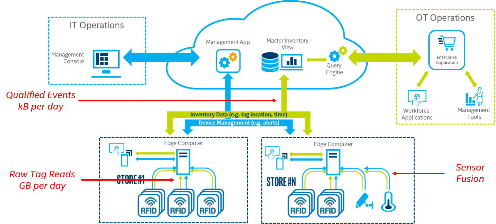
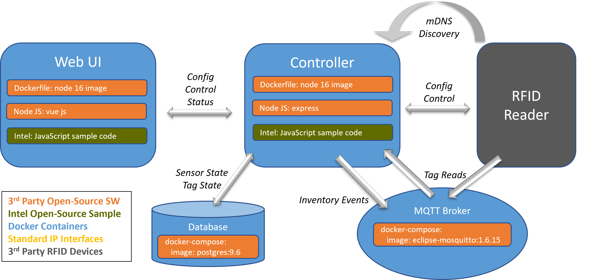
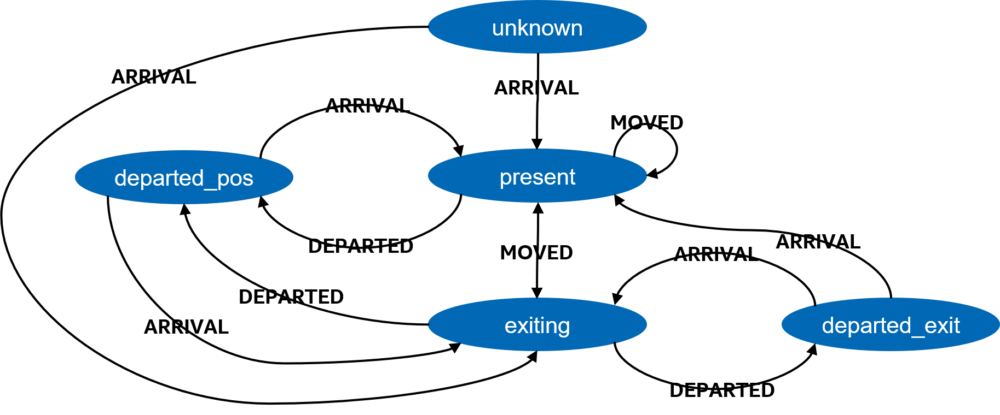

# RFID Edge Controller
The RFID Edge Controller is an edge compute workload reference design that discovers, 
configures and manages a set of [RAIN RFID Readers](https://rainrfid.org/technology/readers/) 
via the [Impinj IoT Interface](https://platform.impinj.com/site/docs/reader_api). 
The RFID Edge Controller also aggregates and processes the stream of tag reads generated 
by each reader to create "Qualified Events" that can easily be consumed by an enterprise 
level Inventory Management System.  

This software is not intended to be a complete end-to-end inventory management solution.

## Table of Contents
1. [System Level Context](#system-level-context)
2. [Prerequisites](#prerequisites)
3. [Building the Project](#building-the-project)
4. [Software Architecture](#software-architecture)
5. [Runtime Environment and Sensitive Data](#runtime-environment-and-sensitive-data)
6. [Developing Natively](#developing-natively)
7. [Developing with VS Code in Docker](#developing-with-vs-code-in-docker)
8. [Tutorials](TUTORIALS.md)

## System Level Context
A complete end-to-end Inventory Management solution might look something like the figure below. 
One or more [RAIN RFID Readers](https://rainrfid.org/technology/readers/) send raw tag read data 
to an RFID Edge Controller workload running on an Intel® based compute device. 
The RFID Edge Controller aggregates and processes the raw tag read data produced by the readers 
and generates qualified events regarding the location and movement of each tag.
Rather than sending gigabytes of raw data to the cloud every day, only kilobytes of qualified 
event data is sent.  



## Prerequisites
* [Docker](https://get.docker.com)
* [Docker compose](https://docs.docker.com/compose/install/)
* [git](https://git-scm.com/book/en/v2/Getting-Started-Installing-Git)  
* Impinj Sensors must all have the same username/password and have the REST API enabled

### Clone The Repo
Get the source downloaded to the development machine before continuing as further
instructions expect this to be done and reference the root of the project directory.

### Create .env File
At the root of the project, copy the .env.template file to just .env and then in
your favorite editor, adjust the variables as described in the file.

## Building and Running The Project
*Make sure the [prerequisites](#prerequisites) are set up properly first.*  
*!! NOTE !! Port 80 (and 443 for https) must be available.*  
Change directory to the top level of the project and execute the run.sh script.
```bash
> ./run.sh
```
This will build (as needed) and start the following containers
- PostgresSQL
- MQTT
- Controller: [http://localhost:3000](http://localhost:3000)
- Web Ui: [http://localhost:8080](http://localhost:8080)<br><br>

The first time this script is run, it will take a bit of time to download/build the docker
images used in the project. The default port mappings used for the web-ui container are 
80 (http) and 443 (https) so several commands used in the script are run via sudo.
By default, the APIs for both the controller and web-ui only enable http. The script
also supports running with https enabled. For more information ...
```bash
./run.sh --help
```

### Run with Certificates for HTTPS
The gen-cert.sh script handles generating private key and self-signed certificate using
the OpenSSL docker image. Check the run.sh script for details, but at a high level, certs
are generated if needed in subdirectories of controller and web-ui and then the docker-compose-https.yml
is used to make those local scripts available in the container.

After the certificates are generated, the user will need to add BOTH the web-ui and controller certs
into the browswers trusted certificates. The easiest way is to just navigate the the URL and then 'accept the risk'
The web-ui is running on the default port (443) and the controller is running on port 3443.
For example, if the web browser accesses the web-ui at https://localhost, that certificate must be 'accepted'
and then also navigate to https://localhost:3443 and 'accept' that one as well by clicking through the 
self signed certificate warning. Also, localhost is interpreted as different than 127.0.0.1 so that would
require navigating to https://localhost/ and https://localhost:3443 (app controller)

## Software Architecture
<br><br>

## Web Ui
A [Vue.js](https://vuejs.org/) based web front end that talks to the controller.

## Controller
The "controller" is the [Node.js + Express](https://expressjs.com/) "Back End". 
Check out the Controller API [here](controller/api/swagger.yml).
The "Back End" consists of three main services; auth-controller, sensor-controller, and tag-controller.

### Auth-Controller
This service manages the authentication to the Back End [API](controller/api/swagger.yml).

### Sensor-Controller
This service discovers, configures, and manages the deployment of RAIN RFID Readers.

### Tag-Controller
This service aggregates and processes the raw tag reads from each RAIN RFID Reader and generates 
three types of "Qualified Events"; ARRIVAL, MOVED, and DEPARTED. 
Below is the Tag Controller State Machine.  

  

# Runtime Environment and Sensitive Data

For both native and docker development, sensitive data - such as usernames and passwords - are
read from runtime environment variables and the project supports a .env file at the root of the project.

# Development
The following instructions assumes a Linux environment.  
The project will build docker images for the controller and web-ui. These projects can both be run
'locally' but the postgres-db and mqtt-broker must be running as well. Use the ./run.sh --dev to start
the supporting containers as needed.

## Install NVM and a Node version
*Recommend using [NVM](https://github.com/nvm-sh/nvm) to manage [Node](https://nodejs.org) installed versions*
If you do not have node available already, please see the installation instructions at the previous links.
At a glance, install nvm and then use it to install node.  

```bash
# check that node is added to the path and returns a version string
node -v
```

## Run the Database and MQTT Broker
```bash
# start the postgres-db and mqtt-broker containers in the foreground
./run.sh --dev --foreground
```

## Run the Controller and/or Web UI from your IDE
Be sure to pass in appropriate environment variables and then check package.json scripts
section for the corresponding development start commands

## Start the Controller and/or Web UI via Command Line
In a new terminal window from the top project directory
```bash
# be sure the .env variables are available
export $(cat .env | grep -v '#' | sed 's/\r$//' | awk '/=/ {print $1}' )

# controller
cd ./controller
# install node dependencies (if needed)
npm install
# uses npm to execute the start:dev script from package.json
npm run start:dev

# web-ui
cd ../web-ui
# install node dependencies (if needed)
npm install
# uses npm to execute the serve script from package.json
npm run serve
```

## Clearing Data and Rebuilding Images
There are several docker volumes used to store things like the authentication
password, the database, and others. See the docker-compose.yml file for more information.  

To clear that data, run the following...
```shell
docker-compose down -v
```

Rebuilding images can be forced using the run.sh script
```shell
./run.sh --build
```
