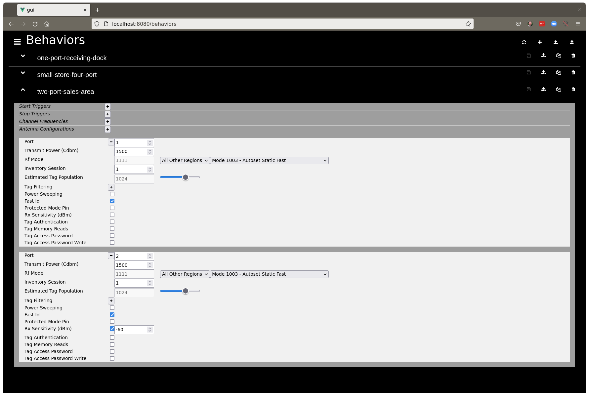
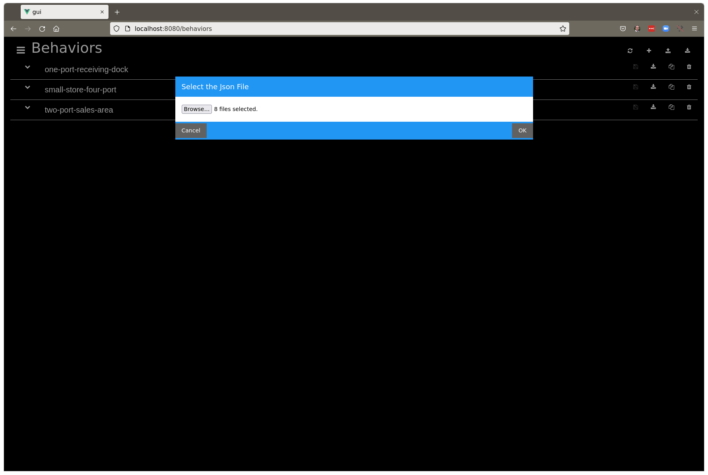
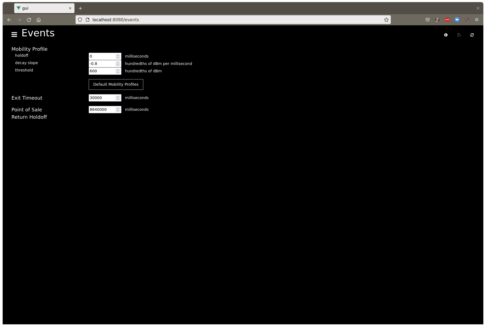

# Tutorials

The following tutorials will guide you through the basics of using the RFID Edge
Controller [Web UI](http://localhost:8080).

## Table of Contents

1. [First Time Log In](#first-time-log-in)
2. [Main Menu](#main-menu)
3. [Creating a Behavior](#creating-a-behavior)
4. [Setting Antenna Configurations](#setting-antenna-configurations)
5. [Uploading one or more Behaviors](#uploading-one-or-more-behaviors)
6. [Sensor Configuration](#sensor-configuration)
7. [Antenna Port Name and Facility](#antenna-port-name-and-facility)
8. [Antenna Personality](#antenna-port-personality)
9. [Sensor Control](#sensor-control)
10. [Events Configuration](#events-configuration)
11. [MQTT Configuration](#mqtt-configuration)
12. [Upstream Inventory Events](#upstream-inventory-events)
13. [Tag Database View](#tag-database-view)
14. [Firmware Update](#firmware-update)

## First Time Log In

Point your browser to the [Web UI](http://localhost:8080), you will be prompted
for a password. If this is your first time logging in, the password you enter
will become the Web UI password going forward.  
(_Optional_) The App Controller Base URL can also be set from here.
By default, the web ui assumes the app controller is available on the host that
serves the web ui on port 3000 for http or 3443 for https.


## Main Menu

After you've logged in, click the menu icon (three horizontal lines) to see the
Web UI Main Menu.


## Creating a Behavior

In order to read tags, the RFID Edge Controller must be loaded with at least one
set of RF parameters called a "Behavior". In this case, a "Behavior" is nothing 
more than an Impinj Preset with a name associated to it. You can create a Behavior 
from scratch, or upload one that was created previously. To create a new Behavior 
from the Behaviors menu, click the "+" icon and give your new behavior a name 
that makes sense to you.


## Setting Antenna Configurations

Be sure your Behavior has an Antenna Configuration assigned for each external
antenna port you plan to activate. At a minimnum, each Antenna Configuration
needs a Power Level, RF Mode and Inventory Session specified. Additional Impinj
Preset parameters can be specified by checking the respective box.



Once a Behavior has been created, you can download a JSON formatted version of
that Behavior to your PC by clicking the arrow down icon next to the Behavior
name. You can also download a JSON formatted version of all the Behaviors at
once by using the arrow down icon located at the very top right of the Behaviors
page.

## Uploading one or more Behaviors

To Upload one or more JSON formatted Behaviors from your PC, click on the arrow
up icon located at the very top right of the Behaviors page. 
Click the "Browse..." button to find and select the Behavior(s) you wish to upload and
click "OK".



Once a Behavior has been uploaded, it will appear in the Behaviors list along
with the others that you created. You can edit an uploaded Behavior in the same
manner as one that was created.


## Sensor Configuration

Now that one or more Behaviors exist, you can assign them to your fleet of RAIN
RFID Readers. From the Main Menu, select "Sensor > Config". Any RFID Readers
that are currently turned on and connected to the network will be automatically
discovered and added to the list. If you would like to prepare a configuration
for a Reader that is not yet connected to the network, you can add one to the
list by clicking on the "+" icon in the upper right corner of the "Sensor > Config" page. 
**THE NAME YOU ASSIGN TO A NEW READER MUST FOLLOW THE FORMAT "impinj-xx-yy-zz"**,
where x, y and z are the last three octets of the Reader's Ethernet MAC address. 
RFID Readers not yet connected to the network will display an IP Address of "unknown".


NOTE: BE SURE TO SAVE YOUR CHANGES BY CLICKING THE DISK ICON FOR EACH SENSOR
CONFIGURATION YOU MADE CHANGES TO!

### Antenna Port Name and Facility

Now you can assign your Reader one of the Behaviors previously created (or
uploaded) from the dropdown menu. BE SURE YOUR SENSOR CONFIG HAS THE SAME NUMBER
OF PORTS CONFIGURED AS THE BEHAVIOR YOU ARE ASSIGNING. Be sure to assign
meaningful values to the Port Name and Facility as these text strings are key
parts of the "Qualified Events" generated by the RFID Controller. 
The port "Name" is used to identify a specific Sensor/Antenna-Port combination. 
This string is used to identify the location of tags in the inventory database. 
The port "Facility" is used to create zones that govern tag event generation. 
Tags "ARRIVE" in and "DEPART" from a facility. Tags "MOVE" from one location to
another within a facility.


### Antenna Port Personality

Personalities are used to optionally identify special functionality for a
Sensor. Tag reads from these Sensors have unique meaning and are handled
differently by the tag processing algorithms.

#### EXIT

As the name implies, an EXIT personality indicates that the antenna is located
at or near the exit of a facility. Tags that are read by these antennas are
highly likely to be on their way out. A "DEPARTED" event is generated by RFID
Controller when a tag is last read by an EXIT antenna and not read again by any
other antenna for some amount of time. The [Exit Timeout](#exit-timeout) is
configurable in the "Events" menu. If the tag is read again after the "DEPARTED"
event was sent, the RFID Controller will generate a new "ARRIVAL" event. 
Careful antenna alignment and timeout configuration is required to prevent 
the RFID Controller from generating large numbers of "DEPARTED" and "ARRIVAL" events.

#### Point Of Sale (POS)

A Point-of-Sale personality is typically used at either a store checkout
or exit portal. When a tag is read by an antenna that is assigned a POS
personality, the RFID Controller will immediately generate a "DEPARTED" event
for that tag. The RFID Controller will NOT generate a new "ARRIVAL" event for
that tag until the [Point of Sale Return Holdoff](#point-of-sale-return-holdoff)
time has elapsed. This time should be configured to reflect the maximum amount
of time an item might remain in the store after being purchased. The "
Point-of-Sale Return Holdoff" is configurable in the "Events" menu.

## Sensor Control

Once you have configured your readers and saved your changes, they will by
default begin reading tags. You can stop all readers at any time by toggling
the "Run State" at the top of "Sensor > Control" page. When the run state is "
Active", the "Sensor > Control" page will reflect the current status of each
reader and the "Behavior" that is assigned to it. If the assigned "Behavior"
contains "Start Triggers" or "Stop Triggers", the status may not always show "
running". If no triggers exist in the Behavior and the reader's status remains "
idle" even with the "Run State" toggled on, check the log for errors to see what
might have happenned.


## Events Configuration

The "Events" page contains the configuration parameters that control the "MOVED"
and "DEPARTED" event generation.



### Mobility Profile

A tag’s location is associated with a particular reader and antenna name. That
location is determined based on the “quality” of the tag reads (i.e. RSSI, read
rate) averaged over time. For a tag’s location to move from one antenna to
another, the reported new RSSI and read rate must be better than a calculated
threshold that is added to the current location's RSSI. The “Mobility Profile”
defines a curve used to calculate this threshold.

From the linear equation

```
y = m(x) + b

y = RSSI Adjustment
m = RSSI decay rate over time (i.e., slope)
x = Time since last tag read
b = RSSI threshold (i.e., new location must be better than old by b dB)
```

The holdoff is how long to wait before applying the RSSI adjustment, so the
equation becomes

```
rssiAdjustment = slope(time - holdoff) + threshold
```

Then we bound rssiAdjustment by a (max = threshold) and a (min = -50 dBm)
creating an RSSI Adjustment curve that looks something like this...


### Exit Timeout

A "DEPARTED" event is generated by RFID Controller when a tag is last read by an
antenna that is assigned an EXIT Personality and not read again by any other
antenna for this configurable amount of time (in milliseconds).

### Point of Sale Return Holdoff

When a tag is read by an antenna that is assigned a POS personality, the RFID
Controller immediately generates a "
DEPARTED" event for that tag. The RFID Controller will NOT generate a new "
ARRIVAL" event for that tag until this configurable amount of time (in
milliseconds) has elapsed.

## MQTT Configuration

A [Mosquitto MQTT Broker](https://mosquitto.org/) is included as one of the
containers in the RFID Edge Controller. By default, it is used for both
receiving information from the RFID Readers on the "Downstream" side and sending
qualified inventory events to a local or cloud based Inventory Management System
on the "Upstream" side. Configuration for the host, port, username, and password are from the following 
environment variables.  

MQTT_UPSTREAM_HOST='localhost'  
MQTT_UPSTREAM_PORT=1883  
MQTT_UPSTREAM_USERNAME=''  
MQTT_UPSTREAM_PASSWORD=''  
MQTT_DOWNSTREAM_HOST=  
MQTT_DOWNSTREAM_PORT=1883  
MQTT_DOWNSTREAM_USERNAME=''  
MQTT_DOWNSTREAM_PASSWORD=''  

## MQTT Pub/Sub Topics

The following MQTT topics are used by the RFID Edge Controller and associated
RFID Readers.

### rfid/data

This "Downstream" topic is used by the RFID Readers to "Publish" raw tag
information and device status. The RFID Edge Controller "Subscribes" to this
topic.

### rfid/will

This "Downstream" topic is used by the RFID Readers to "Publish" their "Last
Will and Testiment". The RFID Edge Controller "Subscribes" to this topic.

### rfid/events

This "Upstream" topic is used by the RFID Edge Controller to "Publish" qualified
inventory events. The Inventory Management Application should "Subscribe" to
this topic.

### rfid/alerts

This "Upstream" topic is used by the RFID Edge Controller to "Publish" alerts
regarding failed readers or other error conditions. The Inventory Management
Application should "Subscribe" to this topic.

## Upstream Inventory Events

The Upstream Inventory Events sent by the RFID Edge Controller are intended to
be consumed by an Inventory Management Application. These events are generated
by the RFID Edge Controller according to
the [Tag State Machine](README.md#tag-controller) and "published" to the MQTT
topic shown [above](#rfidevents). The event schema is shown below. Notice that "
items" is an array.

```
{
   "sentOn":"2022-02-27T18:47:01.150Z",
   "items":[
      {
         "facilityId":"store-1234",
         "epc":"30143639F8419145BEEF0650",
         "tid":"E28011002000515AE0F20888",
         "type":"arrival",
         "timestamp":"2022-02-27T18:47:01.136Z",
         "location":{
            "deviceId":"impinj-14-31-68",
            "antennaPort":1,
            "antennaName":"receiving"
         }
      }
   ]
}
```

## Tag Database View

The "Tags" page contains a filterable view of the tag database. The table will
automatically update by turning on "Polling" in the upper right corner of the 
window and adjusting the polling rate using the dropdown.


## Firmware Update

The RFID Edge Controller can also be used to manage and apply firmware updates
to one or more of the RFID Readers under its control. Simply upload the various
firmware files to RFID Controller and apply them to the appropriate reader(s).

### Firmware Upload

To upload a firmware file from the "Sensor Firmware" page, click on the "arrow up"
icon in the images row. When the "Select the Firmware FIle" window appears, 
click the "Browse" button to select one or more files from your PC 
and click the "OK" button to upload.


### Sensor Upgrade

Once you have uploaded one or more firmware files to the RFID Edge Controller,
you can use them to upgrade the firmware on one or more readers. To upgrade the
firmware on a reader, click the "Upgrade" icon next to the Sensor. A dropdown of
all the uploded firmware files will appear.


A confirmation window will appear. Click the "OK" button to proceed with the
upgrade.


Now, just sit back, relax, and watch the progress of the upgrade.


When complete, the reader will reboot and reconnect to the RFID Edge Controller
showing the newly installed firmware version.


